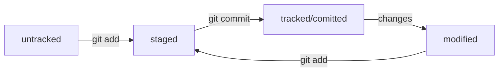

# _Шпраргалка_ по Git

---

### Команды терминала

- cd смена директории
- mkdir создание директории
- touch создание файла
- ls посмотреть содержимое текущей папки
---
### Работа с репозиториями

- git init инициализировать git репозиторий
- git add . добавить все файлы в список для коммита
- git status статус файлов
- git commit закоммитить изменения
- git remote add origin __{url}__ связать локальный репозиторий с удаленным
- git push -u origin main запушить изменения на удаленный репозиторий
---
### Немного о хэшах

- Git преобразует информацию о коммитах с помощью алгоритма SHA-1 и для каждого из них рассчитывает уникальный идентификатор — __хеш__.
- _Хеш_ — основной идентификатор коммита и позволяет узнать его автора, дату и содержимое закоммиченных файлов.
- Все хеши, а также таблицу соответствий хеш → информация о коммите Git хранит в папке .git.
---
### Жизненный _цикл_ файла в __Git__

Большинство файлов в проектах «шагает» по следующему циклу: «изменён» → «добавлен в список на коммит» → «закоммичен» → «изменён» → и так далее.

---
### Статусы файлов в Git репозитории
- Статусом __untracked__ помечается файл, о существовании которого Git знает, но не следит за изменениями в нём.
- Этот статус — противоположность __tracked__, в который попадают все файлы, отслеживаемые Git.
- Файл переходит в статус __staged__ после выполнения _git add_.
- Статус __modified__ означает, что файл был изменён.
---
### Если что-то пошло не так

#### Unstage изменений

Если файл был случайно добавлен в __staged__ командой _git add_, его можно вернуть к состоянию __untracked/modified__ вот так

```git
git restore --staged <file>
```

#### Возврат к более раннему _commit_

Вернуть состояние репозитория к более раннему можно вот так

```git
git reset --hard <commit hash>
```

##### Внимание!

_git reset_ удаляет commit новее того, на который мы откатываемся

#### «Откатить» изменения, которые не попали ни в staging, ни в commit

Изменения в файле откатятся до последнего __add/commit__, файл лишится статуса __modified__

```git
git restore <file>
```
